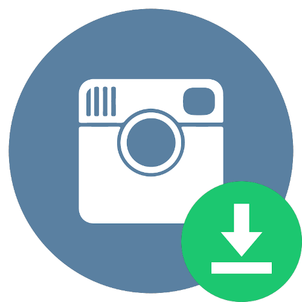

<p align="center"></p>

<h1 align="center">Instascrape</h1>

<p align="center"><strong><i>A fast and lightweight Instagram media downloader.</i></strong></p>

<div align="center">
  
</div>
<div align="center">
  <sub>Downloading 50 timeline posts and tagged posts (excluding videos) with preload option enabled, within 60 seconds.</sub>
</div>

<br>

<p align="center">
  <a href="https://github.com/a1phat0ny/instascrape/releases"></a>
  <a href="https://pypi.python.org/pypi/instascraper"></a>
  <a href="https://pypi.python.org/pypi/instascraper"></a>
  <a href="./LICENSE.txt"></a>
  <a href="https://paypal.me/tonychan2342"></a>
</p>

<div align="center">
    <sub><strong>Made with ♥︎ by a1phat0ny</strong></sub>
    <br>
    <sub><strong>MIT © 2019 Tony Chan</strong></sub>
</div>

---

**Instascrape** is a fast and lightweight utility and Python library for downloading a massive amount of media (photos and videos)
from Instagram, without using the official Instagram Public API.

> What makes **Instascrape** special, is that **Instascrape** aims at high efficeiency and speed.
> It provides a *preload* option that fetches and loads the full data of every item (Post/Profile) beforehand,
> using multithreading with the *producer-consumer* strategy.

## Features

* 🔌 Powerful & simple-to-use library interface
  * ⛓ calls methods in a chain (fluent interface)
  * 🔩 provides hooks/callbacks in download methods
* 🚸 User-friendly commad-line interface
* 💨 High efficiency
  * 🧵 uses multithreading to fetch data
  * ⚡️ uses generators to yield results
* 🔎 Provides a *filter* option to avoid downloading media that you don't want
* 📑 Download media along with their metadata
* ⚠️ Good exceptions handling
* 🍪 Manages multiple cookies for you
* 🔑 Peforms authentication effectively
  * 🔐 supports 2FA
  * 🖇 solves checkpoint challenge
* 🕶 Can be used in anonymous mode

## Prerequisites

▸ Please make sure you have **Python 3.5+** installed in your machine.

#### Dependencies

* requests (https://github.com/requests/requests)
* tqdm (https://github.com/tqdm/tqdm)
* colorama (https://github.com/tartley/colorama)

## Installation

#### Lastest PyPI Stable Release (Recommended)

`$ pip install instascraper`

> **NOTE:** Be careful when installing! The project name on PyPI is `instascraper`, not `instascrape`,
>since the name `instascrape` has been taken by another project.

#### Latest GitHub Commit

```shell script
$ git clone https://github.com/a1phat0ny/instascrape.git
$ cd instascrape
$ python setup.py install
```

## Quickstart

To quickly download 100 timeline posts of Emma Watson ([@emmawatson](https://instagram.com/emmawatson)) that have more than 1M likes, 

### Command-line

`$ instascrape down @emmawatson -timeline -PF "likes_count >= 1000000" -l 100 --preload -d ~/Pictures/Instagram`

### Library

```python
from instascrape import Instascraper

with Instascraper() as insta:
    posts = insta.profile("emmawatson").timeline_posts()
    posts.limit(100).preload(True).filter(lambda p: p.likes_count >= 1000000)
    posts.download_all(dest="/Users/user/Pictures/Instagram")
```

## Usage

TODO

~~For command-line (CLI) usage, see [`CLI.md`](./CLI.md).~~

~~For library (API) usage, see [`API.md`](./API.md).~~

## Disclaimer

This project is in no way authorized, maintained or sponsored by Instagram. Use Instascrape responsibly,
do not use it for spamming or illegal activities.

We are not responsible for any kinds of negative actions that results from the use of *Instascrape*.
This is an independent and unofficial project. Use at your own risk.
